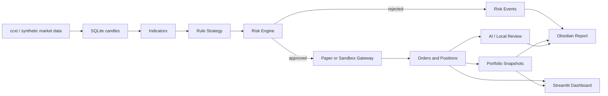

# Vibe Trading Bot

Risk-first AI-native crypto trading assistant with Obsidian reports and an executable dashboard.

> This project is for research, paper trading, sandbox validation, and carefully gated small-capital spot execution. It is not financial advice and does not guarantee profit.

## What It Does

- Watches BTC/USDT and ETH/USDT on a 15-minute cycle.
- Uses explainable rules instead of black-box AI order decisions.
- Combines 4h trend, 1h momentum, and 15m entry confirmation.
- Runs strict risk checks before any order intent reaches execution.
- Supports local paper trading, Binance Spot Testnet-style sandbox execution, and gated small-capital live spot execution.
- Stores candles, signals, risk events, orders, positions, snapshots, and reviews in SQLite.
- Computes trading-journal performance metrics: filled orders, closed trades, win rate, realized PnL, fees, profit factor, return, and drawdown.
- Generates an Obsidian Markdown account dashboard.
- Provides an executable Streamlit control dashboard.
- Uses AI only for explanation/review/suggestions, never for bypassing risk controls.

## Architecture



## Quick Start

For the simplest Chinese workflow, open:

[中文傻瓜版说明.md](中文傻瓜版说明.md)

The project also includes macOS double-click scripts:

```text
1_编辑API配置.command
2_检查真实交易配置.command
3_打开真实交易控制台.command
4_紧急停止.command
5_解除紧急停止.command
6_停止控制台.command
7_打开5U真实试用控制台.command
```

Command-line workflow:

```bash
cd ~/Downloads/vibe-trading-bot
python3 -m venv .venv
source .venv/bin/activate
python -m pip install -U pip
python -m pip install -e ".[dev,ai]"

vibe-trader init-db
vibe-trader run-once
open reports/obsidian/account_dashboard.md
```

The default config uses synthetic market data and paper trading, so it runs without API keys.

For the full Chinese tutorial, see [QUICKSTART.md](QUICKSTART.md).

## Sandbox Mode

1. Copy `.env.example` to `.env`.
2. Fill Binance Spot Testnet keys, not production keys.
3. Confirm the key has no withdrawal permission.
4. Run:

```bash
vibe-trader --config configs/sandbox_binance.yaml doctor
vibe-trader --config configs/sandbox_binance.yaml run-once
```

If local and exchange state diverge, the risk engine blocks trading.

## Commands

```bash
vibe-trader init-db
vibe-trader run-once
vibe-trader backtest
vibe-trader schedule
vibe-trader dashboard
vibe-trader doctor
vibe-trader manual-order --symbol BTC/USDT --side buy --quote-qty 10
vibe-trader performance
```

## Risk Controls

- Paper/sandbox first.
- Live execution requires `configs/live_binance_spot_small.yaml` plus environment confirmations.
- API keys only through environment variables or `.env`.
- `.env` and SQLite databases are ignored by Git.
- Max symbol exposure.
- Max total exposure.
- Max single-trade loss.
- Max daily loss.
- Cooldown after trades.
- Consecutive-loss pause.
- Data anomaly pause.
- Reconciliation gate before execution.
- Duplicate-order prevention.
- Persistent pause and kill switch.

Details: [docs/risk_policy.md](docs/risk_policy.md)

## Obsidian Dashboard

Generated files:

```text
reports/obsidian/account_dashboard.md
reports/obsidian/daily/YYYY-MM-DD.md
```

Dashboard sections:

- Account Overview
- Performance Summary
- Positions
- Risk Indicators
- Today Operations
- Latest Signals
- Recent Risk Events
- Daily Review

## Streamlit Dashboard

```bash
vibe-trader dashboard
```

The dashboard has executable controls: run once, pause, resume, kill switch, clear kill switch, and manual market orders. Live manual orders require typing `EXECUTE_REAL_ORDER`.

It also shows the same performance metrics as the Obsidian report, so the CLI, Markdown dashboard, and web dashboard share one evaluation layer.

## Project Status

This is v0.2 MVP:

- Suitable for local demo, paper trading, sandbox wiring, and architecture iteration.
- Supports small-capital live spot execution only when all gates are enabled.
- Still requires careful sandbox testing before real-money use.

## Roadmap

- Improve historical backtests with external data import and richer analysis.
- Export trade-journal CSV and equity-curve HTML reports.
- Add exchange-specific sandbox integration tests.
- Add Docker and cron/systemd deployment examples.
- Add richer AI review prompts and parameter-change proposal files.
- Add broker adapters for Alpaca/IBKR/Futu/QMT later.

## License

MIT
